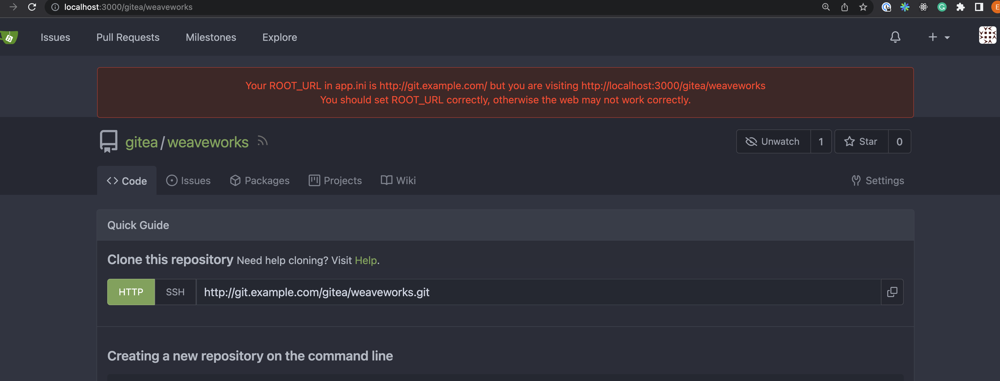

# Just a generic git provider based on go-git-providers

Documenting the question on getting a generic git provider based on jennkins scm

## Scenarios

1. I can interact with a git provider via a generic one 
2. I can create PR using a similar flow to weave gitops enterprise with the generic one 

The code for this part could be found [here](../generic)


##  I can interact with a git provider via a generic one

The aim is that we could create a generic provider that is able to interact with many 
git providers using jenkins scm.

```
Feature: I can create a generic git provider out of jenkins scm
  
  Scenario Outline: can interact with multiple git providers via generic git repo
    Given a git <provider>
    And generic configuration for that git provider
    And a git <repo>
    When created a generic go git provider
    And gotten the git repo
    Then git repo properties are available  

  Examples:
    | provider |  repo        |
    |    azure |   weaveworks |
    |    gitea |   weaveworks |
    |    bitbucketcloud |   weaveworks |  

```

Which is implemented via this [test](generic/auth_test.go)


##  I can create PR using a similar flow to weave gitops enterprise with the generic one


# Gitea 


- I could install  via tmp/gitea.yaml



- I could create a client via test
- I could not create PR due to create branch not avaialble
  https://github.com/jenkins-x/go-scm/blob/main/scm/driver/gitea/git.go#L40

