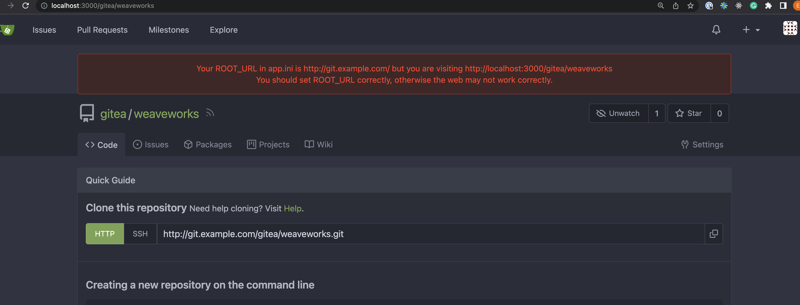

# Just a generic git provider based on go-git-providers

# Gitea 

- I could install  via tmp/gitea.yaml

- I could create a client via test
- I could not create PR due to create branch not avaialble
  https://github.com/jenkins-x/go-scm/blob/main/scm/driver/gitea/git.go#L40

